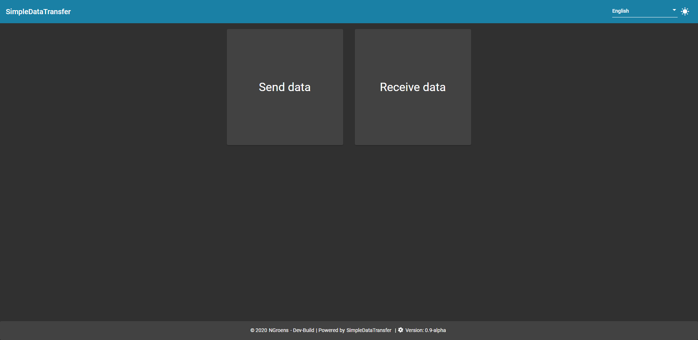
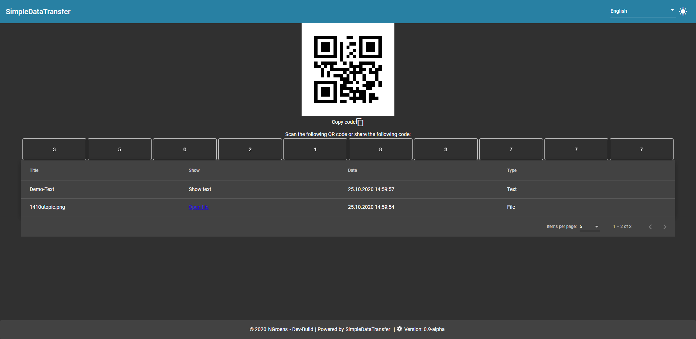
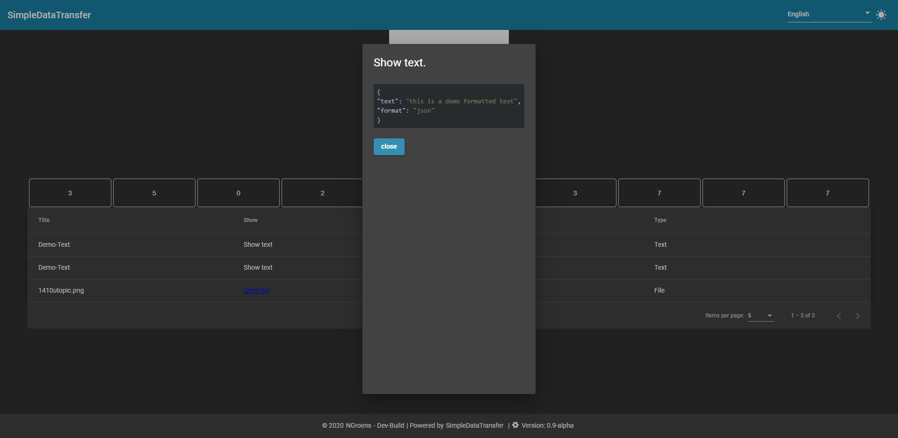
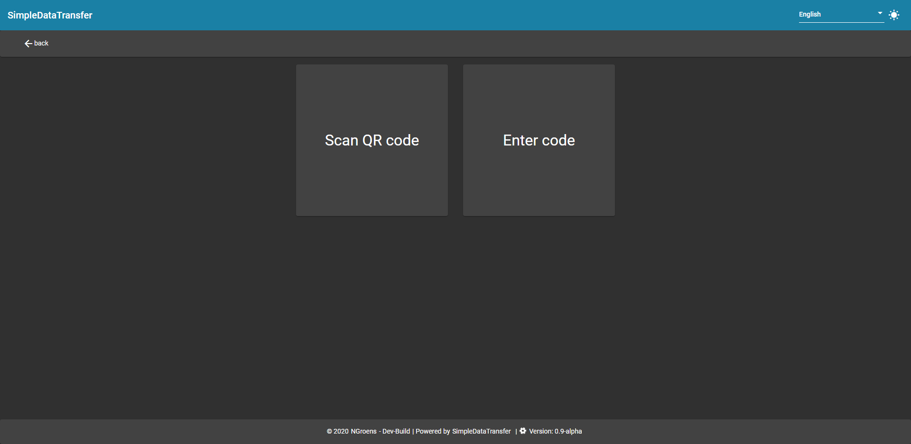
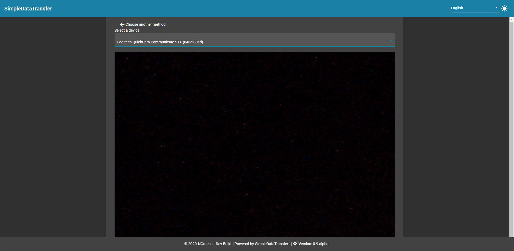
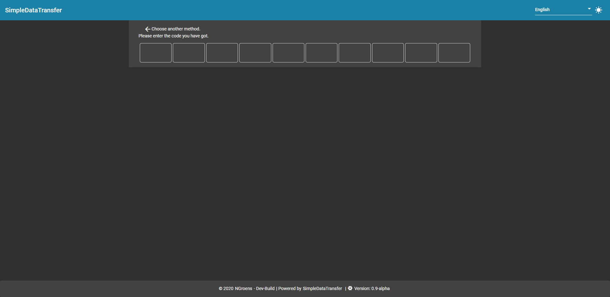
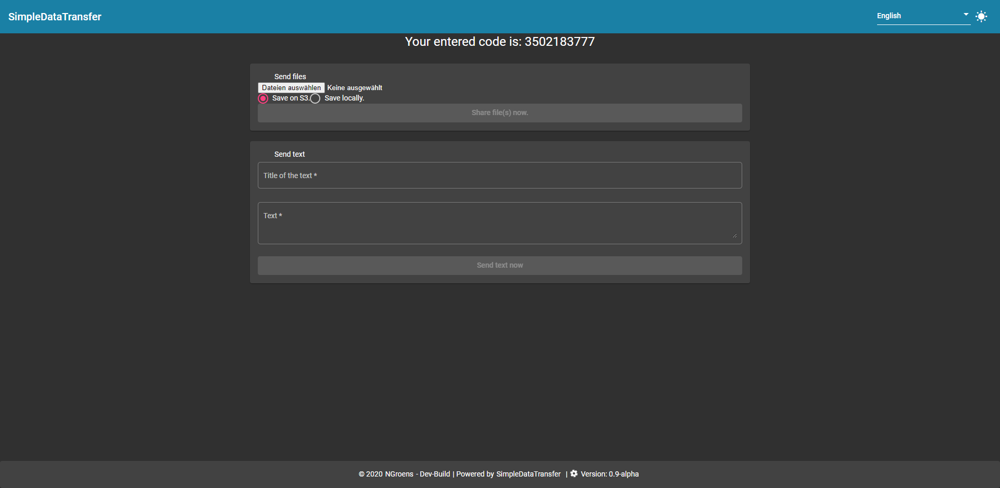
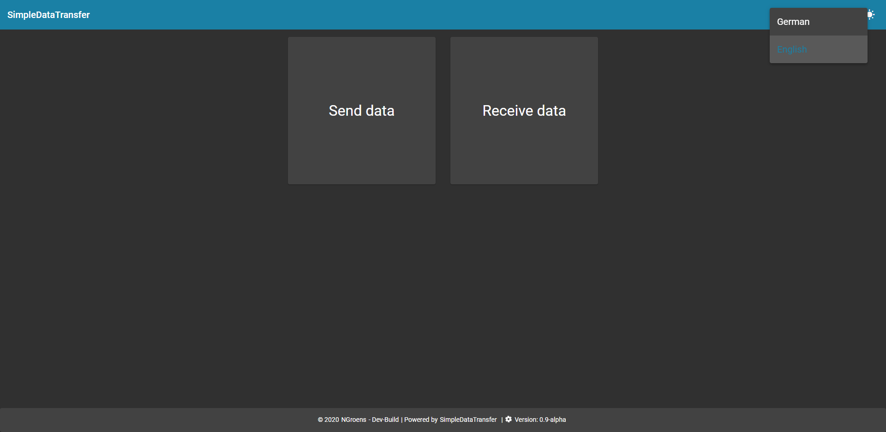
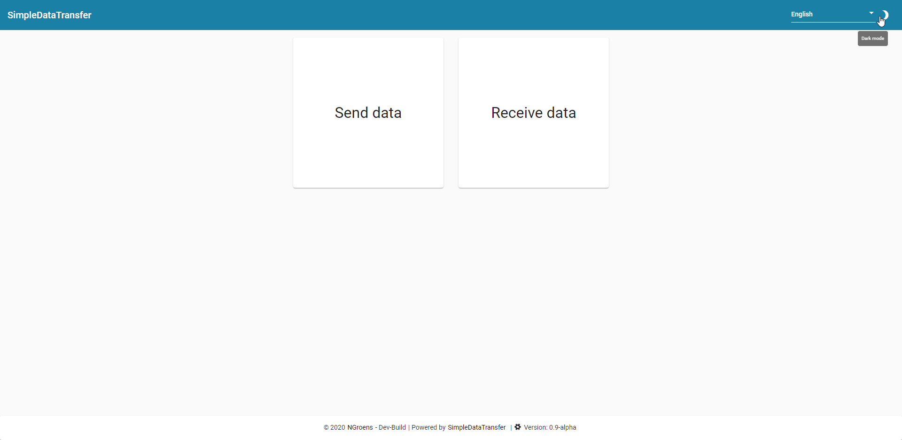

<div align="center">

  <h3 align="center">SimpleDataTransfer</h3>
[![Contributors][contributors-shield]][contributors-url]
[![Forks][forks-shield]][forks-url]
[![Stargazers][stars-shield]][stars-url]
[![Issues][issues-shield]][issues-url]
[![MIT License][license-shield]][license-url]

  <p align="center">
    SimpleDataTransfer is a web application with which you can easily send files and text with a QR code or pin. I started this project for fun to get some experience with nestJS. If you have suggestions for improvements of the code or ideas for new features just open an issue.
    <br />
    <a href="https://github.com/NGroens/SimpleDataTransfer/tree/master/docs"><strong>Explore the docs »</strong></a>
    <br />
    <br />
    <a href="https://sdf.mycoding.systems/public">View Demo</a>
    ·
    <a href="https://github.com/NGroens/SimpleDataTransfer/issues">Report Bug</a>
    ·
    <a href="https://github.com/NGroens/SimpleDataTransfer/issues">Request Feature</a>
  </p>
</div>


<!-- TABLE OF CONTENTS -->
# Table of Contents

* [About the Project](#about-the-project)
  * [Built With](#built-with)
* [Getting Started](#getting-started)
  * [Prerequisites](#prerequisites)
  * [Installation](#installation)
* [Usage](#usage)
* [Roadmap](#roadmap)
* [License](#license)
* [Contact](#contact)


<!-- ABOUT THE PROJECT -->
# About The Project

[![Product Name Screen Shot][product-screenshot]]()
    SimpleDataTransfer is a web application with which you can easily send files and text with a QR code or pin. I started this project for fun to get some experience with nestJS. If you have suggestions for improvements of the code or ideas for new features just open an issue.


A list of commonly used resources that I find helpful are listed in the acknowledgements.

## Built With
* [Angular](https://angular.io)
* [Angular Material Design](https://material.angular.io)
* [NestJs](https://nestjs.com/)


<!-- GETTING STARTED -->
# Getting Started
## Prerequisites


* Node.js - [Install Node.js](https://nodejs.org/en/download/)

* Docker - [Install Docker](https://docs.docker.com/get-docker/)

## Installation for development purposes

1. Clone the repo
    ```sh
    git clone https://github.com/NGroens/SimpleDataTransfer.git
    ```
2. Start docker development environment
    ```sh
    cd sdt-database
    docker-compose -f docker-compose-dev.yml up -d
    ```
    or on Windows
    ```sh
    cd sdt-database
    start-dev.bat
    ```
3. Navigate to backend server, install npm dependencies and start the server
    ```sh
    cd ../sdf-server
    npm i
    npm run start:dev
    ```
4. Navigate to frontend, install npm dependencies and start the application
   ```sh
    cd ../sdf-frontend
    npm i
    npm start    
    ```


# Usage
## Screenshots
### Choose if you want to send or receive data


### Data receive page


### Show highlighted text 


### Select if you want to scan a qr code or enter a pin


### Scan qr code


### Enter pin


### Send a file or text


### Muli language system


### Light and dark mode


<!-- ROADMAP -->
# Roadmap

See the [open issues](https://github.com/NGroens/SimpleDataTransfer/issues) for a list of proposed features (and known issues).


<!-- LICENSE -->
# License

Distributed under the  Apache-2.0 License. See `LICENSE` for more information.


<!-- CONTACT -->
# Contact

NGroens - [sdf@mycoding.systems](mailto:sdf@mycoding.systems) 

Project Link: [https://github.com/NGroens/SimpleDataTransfer](https://github.com/NGroens/SimpleDataTransfer)


<!-- MARKDOWN LINKS & IMAGES -->
<!-- https://www.markdownguide.org/basic-syntax/#reference-style-links -->
[contributors-shield]: https://img.shields.io/github/contributors/NGroens/SimpleDataTransfer.svg?style=flat-square
[contributors-url]: https://github.com/NGroens/SimpleDataTransfer/graphs/contributors
[forks-shield]: https://img.shields.io/github/forks/NGroens/SimpleDataTransfer.svg?style=flat-square
[forks-url]: https://github.com/NGroens/SimpleDataTransfer/network/members
[stars-shield]: https://img.shields.io/github/stars/NGroens/SimpleDataTransfer.svg?style=flat-square
[stars-url]: https://github.com/NGroens/SimpleDataTransfer/stargazers
[issues-shield]: https://img.shields.io/github/issues/NGroens/SimpleDataTransfer.svg?style=flat-square
[issues-url]: https://github.com/NGroens/SimpleDataTransfer/issues
[license-shield]: https://img.shields.io/github/license/NGroens/SimpleDataTransfer.svg?style=flat-square
[license-url]: https://github.com/NGroens/SimpleDataTransfer/blob/master/LICENSE.txt
[product-screenshot]: docs/screenshots/choose-send-or-receive.png
